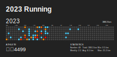

#### Hi there 👋

就是玩！

<picture>
  <source media="(prefers-color-scheme: dark)" srcset="github-snake-dark.svg" />
  <source media="(prefers-color-scheme: light)" srcset="github-snake.svg" />
  
</picture>

|  |  |
| ------------------------------------------------------------------------------------------------------------------------------------------------------------------------------------------------------------------------------------- | ------------------------------------------------------------------------------------------------------------------------------------------------------------------------------------------ |

#### 📚 最近在读

<!-- weread starts -->
- 《曹操》-易中天
<!-- weread ends -->

#### 📑 最新博客

<!-- blog starts -->

<!-- blog ends -->

#### 🏃‍♂️ 跑步

